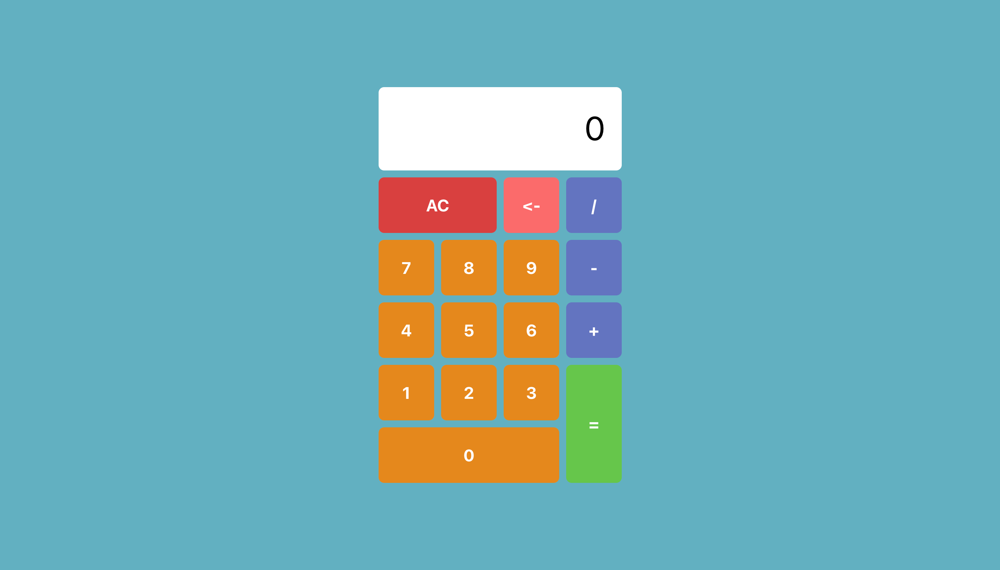

# Calculator (TypeScript) [In Progress]

This is a simple project that I'm currently working on to practice my TypeScript skills.

## Features

I plan for this calculator to carry out basic functions:

- Addition
- Subtraction
- Multiplication
- Division

## Challenges & Lessons Learned (So Far)

### Using TypeScript

- After learning basic JavaScript, I want to challenge myself by learning TypeScript after reading about it's many benefits and growing popularity in industry. This project is the perfect way to practice my skills and contextualise concepts I have learnt.

### CSS

- After predominantly using CSS Flexbox in previous projects, I wanted to become more confident using CSS Grid. Research and following a tutorial has helped me develop a deeper understanding of grid principles.
- This is my first time using styled components and found that writing CSS properties directly in my tsx files made it easy to manage the styling in this project. This is a library that I look forward to incorporating into my future projects.
